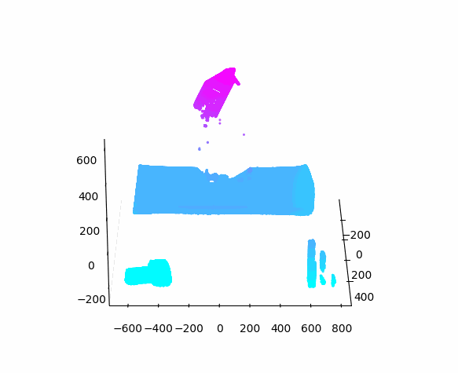
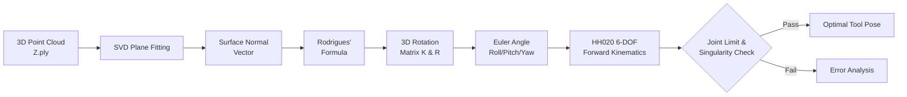

# 🤖 Bin Picking Advancement
> 3D Vision-Robot Auto Calibration & Pose Estimation
  **과기정통부 국가연구개발사업 (서울대 소재·부품·장비 협의체)**  

 

## 📌 연구 개요

  
    

본 연구는 생산 라인에서 활용되는 3D Vision 기반 Bin Picking 로봇의 **Vision-Robot 좌표계 Auto Calibration** 및 **곡면 Sanding 공정을 위한 Tool Pose 최적화**를 목표로 진행되었습니다. (2024 서울대학교 공과대학 산학연계 프로젝트)

기존 Manual Teaching 방식의 비효율성을 개선하고, 곡면 Picking 시 발생하는 직교성 오차 및 기구학적 한계를 수학적 모델링(SVD, Rodrigues' Formula)을 통해 분석하고 해결했습니다.

> ⚠️ **보안 안내**: 본 프로젝트는 기업체 산학연계(NDA) 과제로 수행되어, 기업 보안 데이터 및 상세 스펙은 마스킹 처리되었습니다.

 

---

## 📂 디렉토리 구조

* `01-TransMat.ipynb`: 임의 이동 테스트 기반 Camera-Robot 4D Calibration Matrix 도출
* `02-1-Rodrigues_General.ipynb`: Rodrigues' Formula 기반 3D Rotation Matrix 및 Euler Angle 추출
* `02-2-SVD_PlaneFitting.ipynb`: 3D Point Cloud 데이터(`Z.ply`) SVD Plane Fitting 및 Normal Vector 추정
* `03-HH020_TransMat.ipynb`: 6-DOF 산업용 로봇(HH020) Forward Kinematics 모듈 검증
* `Z.ply`: 검증용 3D Point Cloud 원본 데이터

---

## 🛠️ 핵심 알고리즘 및 수학적 모델링

### 1. Teaching-less Vision-Robot 좌표계 Auto Calibration
작업자의 숙련도에 의존하던 Manual Teaching 방식의 한계를 극복하기 위해, **경험적 평행이동 기반의 변환행렬 산출 알고리즘**을 제안했습니다.

* **알고리즘 원리**: 로봇 팔 좌표계에서 직교 3축($x, y, z$) 방향으로 지정된 거리($k$)만큼 평행이동하는 테스트를 수행합니다.
* **4D Transformation Matrix 도출**: 이동 전후의 Camera 좌표계 측정값을 연립하여 로봇 좌표계에서 Camera 좌표계로 변환하는 $4 \times 4$ Homogeneous Transformation Matrix $A$ 및 역행렬 $A^{-1}$를 산출합니다.
* **연구 결과**: [Issue #1](https://github.com/ben020410/2024W-ETS-BPA/issues/1). Camera 측정 좌표만으로 로봇 팔의 제어 좌표를 실시간으로 정밀 역산하는 파이프라인을 확립했습니다.

### 2. 3D Point Cloud 기반 곡률 매칭 및 Tool Rotation Control
단순 Position 정렬을 넘어, 곡면 Sanding 공정의 핵심인 제품 곡면의 Normal Vector와 로봇 Tool의 지향 벡터를 일치시키는 **Orientation 제어 파이프라인**을 구축했습니다.

* **SVD Plane Fitting**: Camera에서 취득한 Point Cloud 데이터에 SVD를 적용하여 최적의 표면 Normal Vector를 추정합니다.
* **Rodrigues' Rotation Formula**: 두 벡터 간의 회전축 $n$과 회전각 $\theta$ (계산 간소화를 위해 $\theta = \pi$로 설정)를 기반으로 Rotation Matrix $K$를 산출합니다.

$$v' = \left[ I + \sin\theta K + (1 - \cos\theta) K^2 \right] v, \quad K = \begin{bmatrix} 0 & -n_z & n_y \\ n_z & 0 & -n_x \\ -n_y & n_x & 0 \end{bmatrix}$$

* **Euler Angle 추출**: 산출된 Rotation Matrix $R$을 역삼각함수를 통해 로봇 제어기가 인식할 수 있는 Roll-Pitch-Yaw 각도($\alpha, \beta, \gamma$)로 변환합니다.
* **연구 결과**: [Issue #2](https://github.com/ben020410/2024W-ETS-BPA/issues/2), [Issue #3](https://github.com/ben020410/2024W-ETS-BPA/issues/3). Normal Vector 산출 경향성은 이론값과 일치하였으나, 특정 각도에서 오차가 발생함을 확인하여 기구학적 구동 한계 분석으로 연구를 확장했습니다.

### 3. 6-DOF 로봇 Kinematics 분석 (현대로보틱스 HH020)
2단계에서 발생한 제어 오차의 원인을 분석하기 위해 대상 로봇(HH020)의 Kinematics 특성을 모델링했습니다.

* **Forward Kinematics**: 카탈로그 제원 및 HRSpace 시뮬레이션 데이터를 바탕으로, 6개 Joint Angle을 입력받아 End-effector의 최종 Position 및 Rotation을 연산하는 알고리즘을 구현했습니다.
* **오차 원인 규명**: 기존 제어 알고리즘은 목적지까지의 최단 회전량만 산출하므로, 각 관절의 **Joint Limits를 고려하지 못해 Singularity나 충돌 오류가 발생**함을 수학적으로 입증했습니다.

---

## 📐 Mathematical & Data Pipeline

---

## 🚀 Future Work

* **Inverse Kinematics 구현**: 도출된 6-DOF Homogeneous Transformation Matrix를 기반으로, Joint Limit을 회피하여 목표 Pose에 도달하는 Inverse Kinematics 경로 생성 알고리즘 고안
* **Gimbal Lock 문제 해결**: 3차원 Euler Angle 회전 시 발생하는 Singularity 문제를 방지하기 위해 **Quaternion** 기반의 자세 제어 로직 도입

---

## 📜 Acknowledgements & R&D Credits

본 연구는 아래 과제 및 산학협력 프로그램을 통해 수행되었습니다.

* **과학기술정보통신부 / 한국연구재단:** 국가연구개발사업 (과제번호: `RS-2021-NR057855`)
* **서울대학교 공과대학:** 소재·부품·장비 협의체 / 산학협력공학인재지원센터
* **산학협력 기업:** 현대자동차, ㈜아진산업

---

## 📚 References

1. F. C. Park and K. M. Lynch. (2016). *Introduction to Robotics: Mechanics, Planning, and Control*. Northwestern University.
2. Michaela Borzechowski. (2017). *Best-Fit Subspaces and Singular Value Decomposition*. Wolfgang Mulzer.
3. Jamshed Iqbal, et al. (2012). *Modeling and Analyzing of a 6 DOF Robotic Arm Manipulator*. Canadian Journal on Electrical and Electronics Vol. 3, No. 6.
